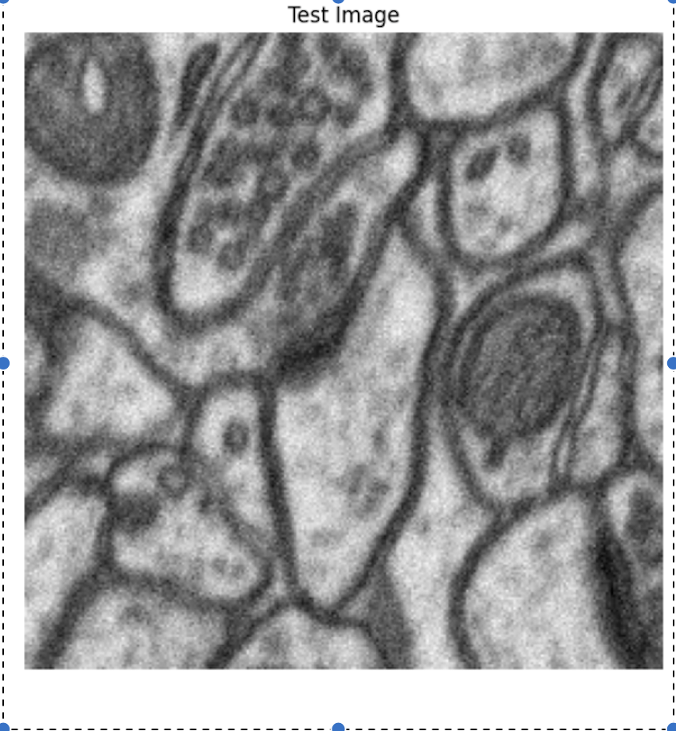
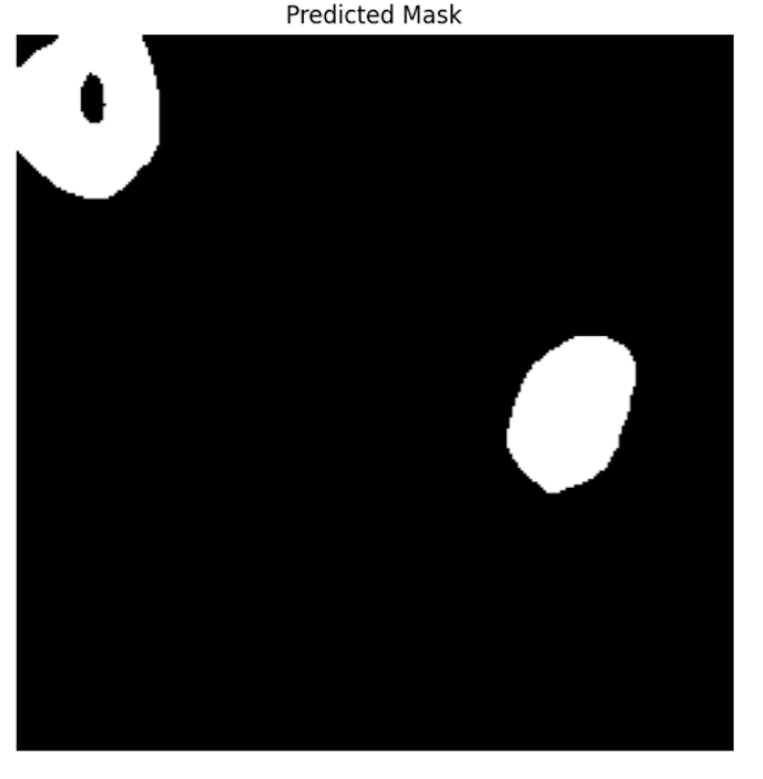

# mitochondria-segmentation-unet
Deep learning project for mitochondria segmentation using U-Net on EM images.
# 🧬 Mitochondria Segmentation using U-Net

## Abstract
This project tackles the challenge of segmenting mitochondria in electron microscopy (EM) images using a U-Net model. We preprocessed the dataset by patchifying large images into 256×256 tiles and applied real-time augmentation to improve generalization. The model was trained using TensorFlow/Keras and evaluated using metrics like Dice coefficient and IoU.

## Results
-  **Pixel Accuracy**: 98.61%
-  **Dice Coefficient**: 0.8563
-  **IoU Score**: 0.7487

## Dataset
- Kaggle: [Electron Microscopy Dataset](https://www.kaggle.com/datasets/)
- Consists of grayscale microscopy images and binary segmentation masks.

##  Methodology
- Patchify input into 256×256 tiles
- Normalize + augment image/mask pairs
- Train a U-Net model with Binary Crossentropy loss
- Evaluate using IoU, Dice, and Pixel Accuracy
- Visualize predictions and error maps

## Tech Stack
- Python, TensorFlow/Keras
- NumPy, Matplotlib, Patchify
- Scikit-Image, OpenCV

## Sample Prediction Output

A visual comparison of the input EM image, ground truth, and the predicted mask from U-Net:

| Input Image | Ground Truth | Predicted Mask |
|-------------|--------------|----------------|
|  |  |  |

## Future Work
- Try Attention U-Net
- Explore semi-supervised segmentation

## Report

📥 [View report](https://github.com/paavni24/mitochondria-segmentation-unet/blob/main/report.pdf)

